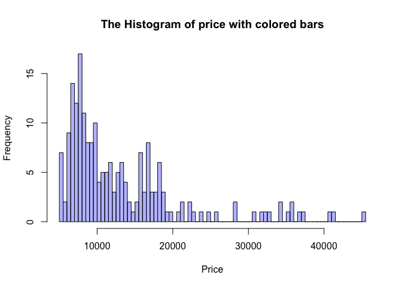

hw01
================
Shi Fan Jin
2/17/2018

#### 2) Data Import (20 pts)

``` r
imports85 <- read.csv('imports-85.data', sep = ',')
imports85 <- read.csv('imports-85.data', header = FALSE)
imports85_matrix <- as.matrix(read.csv('imports-85.data', sep = ','))
str(imports85_matrix)
```

    ##  chr [1:204, 1:26] " 3" " 1" " 2" " 2" " 2" " 1" " 1" ...
    ##  - attr(*, "dimnames")=List of 2
    ##   ..$ : NULL
    ##   ..$ : chr [1:26] "X3" "X." "alfa.romero" "gas" ...

``` r
col_names <- c(
  'symboling',
  'normalized_losses',
  'make',
  'fuel_type',
  'aspiration',
  'num_of_doors',
  'body_style',
  'drive_wheels',
  'engine_location',
  'wheel_base',
  'length',
  'width',
  'height',
  'curb_weight',
  'engine_type',
  'num_of_cylinders',
  'engine_size',
  'fuel_system',
  'bore',
  'stroke',
  'compression_ratio',
  'horsepower',
  'peak_rpm',
  'city_mpg',
  'highway_mpg',
  'price'
)

col_types <- c(
  'real',
  'real',
  'character',
  'character',
  'character',
  'character',
  'character',
  'character',
  'character',
  'real',
  'real',
  'real',
  'real',
  'integer',
  'character',
  'character',
  'integer',
  'character',
  'real',
  'real',
  'real',
  'integer',
  'integer',
  'integer',
  'integer',
  'integer'
)

# Before giving col.names and colClasses:
str(imports85) # ? becomes col type 'Factor'
```

    ## 'data.frame':    205 obs. of  26 variables:
    ##  $ V1 : int  3 3 1 2 2 2 1 1 1 0 ...
    ##  $ V2 : Factor w/ 52 levels "?","101","102",..: 1 1 1 29 29 1 27 1 27 1 ...
    ##  $ V3 : Factor w/ 22 levels "alfa-romero",..: 1 1 1 2 2 2 2 2 2 2 ...
    ##  $ V4 : Factor w/ 2 levels "diesel","gas": 2 2 2 2 2 2 2 2 2 2 ...
    ##  $ V5 : Factor w/ 2 levels "std","turbo": 1 1 1 1 1 1 1 1 2 2 ...
    ##  $ V6 : Factor w/ 3 levels "?","four","two": 3 3 3 2 2 3 2 2 2 3 ...
    ##  $ V7 : Factor w/ 5 levels "convertible",..: 1 1 3 4 4 4 4 5 4 3 ...
    ##  $ V8 : Factor w/ 3 levels "4wd","fwd","rwd": 3 3 3 2 1 2 2 2 2 1 ...
    ##  $ V9 : Factor w/ 2 levels "front","rear": 1 1 1 1 1 1 1 1 1 1 ...
    ##  $ V10: num  88.6 88.6 94.5 99.8 99.4 ...
    ##  $ V11: num  169 169 171 177 177 ...
    ##  $ V12: num  64.1 64.1 65.5 66.2 66.4 66.3 71.4 71.4 71.4 67.9 ...
    ##  $ V13: num  48.8 48.8 52.4 54.3 54.3 53.1 55.7 55.7 55.9 52 ...
    ##  $ V14: int  2548 2548 2823 2337 2824 2507 2844 2954 3086 3053 ...
    ##  $ V15: Factor w/ 7 levels "dohc","dohcv",..: 1 1 6 4 4 4 4 4 4 4 ...
    ##  $ V16: Factor w/ 7 levels "eight","five",..: 3 3 4 3 2 2 2 2 2 2 ...
    ##  $ V17: int  130 130 152 109 136 136 136 136 131 131 ...
    ##  $ V18: Factor w/ 8 levels "1bbl","2bbl",..: 6 6 6 6 6 6 6 6 6 6 ...
    ##  $ V19: Factor w/ 39 levels "?","2.54","2.68",..: 25 25 3 15 15 15 15 15 12 12 ...
    ##  $ V20: Factor w/ 37 levels "?","2.07","2.19",..: 6 6 29 26 26 26 26 26 26 26 ...
    ##  $ V21: num  9 9 9 10 8 8.5 8.5 8.5 8.3 7 ...
    ##  $ V22: Factor w/ 60 levels "?","100","101",..: 7 7 22 4 10 6 6 6 17 25 ...
    ##  $ V23: Factor w/ 24 levels "?","4150","4200",..: 12 12 12 18 18 18 18 18 18 18 ...
    ##  $ V24: int  21 21 19 24 18 19 19 19 17 16 ...
    ##  $ V25: int  27 27 26 30 22 25 25 25 20 22 ...
    ##  $ V26: Factor w/ 187 levels "?","10198","10245",..: 33 52 52 38 63 43 65 73 83 1 ...

``` r
object.size(imports85)  # 43344 bytes
```

    ## 60400 bytes

``` r
imports85 <- read.csv('imports-85.data', sep = ',', col.names = col_names, colClasses = col_types, stringsAsFactors = FALSE, na = '?', header = FALSE)

str(imports85)
```

    ## 'data.frame':    205 obs. of  26 variables:
    ##  $ symboling        : num  3 3 1 2 2 2 1 1 1 0 ...
    ##  $ normalized_losses: num  NA NA NA 164 164 NA 158 NA 158 NA ...
    ##  $ make             : chr  "alfa-romero" "alfa-romero" "alfa-romero" "audi" ...
    ##  $ fuel_type        : chr  "gas" "gas" "gas" "gas" ...
    ##  $ aspiration       : chr  "std" "std" "std" "std" ...
    ##  $ num_of_doors     : chr  "two" "two" "two" "four" ...
    ##  $ body_style       : chr  "convertible" "convertible" "hatchback" "sedan" ...
    ##  $ drive_wheels     : chr  "rwd" "rwd" "rwd" "fwd" ...
    ##  $ engine_location  : chr  "front" "front" "front" "front" ...
    ##  $ wheel_base       : num  88.6 88.6 94.5 99.8 99.4 ...
    ##  $ length           : num  169 169 171 177 177 ...
    ##  $ width            : num  64.1 64.1 65.5 66.2 66.4 66.3 71.4 71.4 71.4 67.9 ...
    ##  $ height           : num  48.8 48.8 52.4 54.3 54.3 53.1 55.7 55.7 55.9 52 ...
    ##  $ curb_weight      : int  2548 2548 2823 2337 2824 2507 2844 2954 3086 3053 ...
    ##  $ engine_type      : chr  "dohc" "dohc" "ohcv" "ohc" ...
    ##  $ num_of_cylinders : chr  "four" "four" "six" "four" ...
    ##  $ engine_size      : int  130 130 152 109 136 136 136 136 131 131 ...
    ##  $ fuel_system      : chr  "mpfi" "mpfi" "mpfi" "mpfi" ...
    ##  $ bore             : num  3.47 3.47 2.68 3.19 3.19 3.19 3.19 3.19 3.13 3.13 ...
    ##  $ stroke           : num  2.68 2.68 3.47 3.4 3.4 3.4 3.4 3.4 3.4 3.4 ...
    ##  $ compression_ratio: num  9 9 9 10 8 8.5 8.5 8.5 8.3 7 ...
    ##  $ horsepower       : int  111 111 154 102 115 110 110 110 140 160 ...
    ##  $ peak_rpm         : int  5000 5000 5000 5500 5500 5500 5500 5500 5500 5500 ...
    ##  $ city_mpg         : int  21 21 19 24 18 19 19 19 17 16 ...
    ##  $ highway_mpg      : int  27 27 26 30 22 25 25 25 20 22 ...
    ##  $ price            : int  13495 16500 16500 13950 17450 15250 17710 18920 23875 NA ...

``` r
object.size(imports85) # 43136 bytes
```

    ## 43344 bytes

``` r
imports85_csv <- read_csv('imports-85.data', na = '?', col_names = col_names, 
                          col_types = cols(
                            symboling = col_double(),
                            normalized_losses = col_double(),
                            make = col_character(),
                            fuel_type = col_character(),
                            aspiration = col_character(),
                            num_of_doors = col_character(),
                            body_style = col_character(),
                            drive_wheels = col_character(),
                            engine_location = col_character(),
                            wheel_base = col_double(),
                            length = col_double(),
                            width = col_double(),
                            height = col_double(),
                            curb_weight = col_integer(),
                            engine_type = col_character(),
                            num_of_cylinders = col_character(),
                            engine_size = col_integer(),
                            fuel_system = col_character(),
                            bore = col_double(),
                            stroke = col_double(),
                            compression_ratio = col_double(),
                            horsepower = col_integer(),
                            peak_rpm = col_integer(),
                            city_mpg = col_integer(),
                            highway_mpg = col_integer(),
                            price = col_integer()
                          )
                        )

str(imports85_csv)
```

    ## Classes 'tbl_df', 'tbl' and 'data.frame':    205 obs. of  26 variables:
    ##  $ symboling        : num  3 3 1 2 2 2 1 1 1 0 ...
    ##  $ normalized_losses: num  NA NA NA 164 164 NA 158 NA 158 NA ...
    ##  $ make             : chr  "alfa-romero" "alfa-romero" "alfa-romero" "audi" ...
    ##  $ fuel_type        : chr  "gas" "gas" "gas" "gas" ...
    ##  $ aspiration       : chr  "std" "std" "std" "std" ...
    ##  $ num_of_doors     : chr  "two" "two" "two" "four" ...
    ##  $ body_style       : chr  "convertible" "convertible" "hatchback" "sedan" ...
    ##  $ drive_wheels     : chr  "rwd" "rwd" "rwd" "fwd" ...
    ##  $ engine_location  : chr  "front" "front" "front" "front" ...
    ##  $ wheel_base       : num  88.6 88.6 94.5 99.8 99.4 ...
    ##  $ length           : num  169 169 171 177 177 ...
    ##  $ width            : num  64.1 64.1 65.5 66.2 66.4 66.3 71.4 71.4 71.4 67.9 ...
    ##  $ height           : num  48.8 48.8 52.4 54.3 54.3 53.1 55.7 55.7 55.9 52 ...
    ##  $ curb_weight      : int  2548 2548 2823 2337 2824 2507 2844 2954 3086 3053 ...
    ##  $ engine_type      : chr  "dohc" "dohc" "ohcv" "ohc" ...
    ##  $ num_of_cylinders : chr  "four" "four" "six" "four" ...
    ##  $ engine_size      : int  130 130 152 109 136 136 136 136 131 131 ...
    ##  $ fuel_system      : chr  "mpfi" "mpfi" "mpfi" "mpfi" ...
    ##  $ bore             : num  3.47 3.47 2.68 3.19 3.19 3.19 3.19 3.19 3.13 3.13 ...
    ##  $ stroke           : num  2.68 2.68 3.47 3.4 3.4 3.4 3.4 3.4 3.4 3.4 ...
    ##  $ compression_ratio: num  9 9 9 10 8 8.5 8.5 8.5 8.3 7 ...
    ##  $ horsepower       : int  111 111 154 102 115 110 110 110 140 160 ...
    ##  $ peak_rpm         : int  5000 5000 5000 5500 5500 5500 5500 5500 5500 5500 ...
    ##  $ city_mpg         : int  21 21 19 24 18 19 19 19 17 16 ...
    ##  $ highway_mpg      : int  27 27 26 30 22 25 25 25 20 22 ...
    ##  $ price            : int  13495 16500 16500 13950 17450 15250 17710 18920 23875 NA ...
    ##  - attr(*, "spec")=List of 2
    ##   ..$ cols   :List of 26
    ##   .. ..$ symboling        : list()
    ##   .. .. ..- attr(*, "class")= chr  "collector_double" "collector"
    ##   .. ..$ normalized_losses: list()
    ##   .. .. ..- attr(*, "class")= chr  "collector_double" "collector"
    ##   .. ..$ make             : list()
    ##   .. .. ..- attr(*, "class")= chr  "collector_character" "collector"
    ##   .. ..$ fuel_type        : list()
    ##   .. .. ..- attr(*, "class")= chr  "collector_character" "collector"
    ##   .. ..$ aspiration       : list()
    ##   .. .. ..- attr(*, "class")= chr  "collector_character" "collector"
    ##   .. ..$ num_of_doors     : list()
    ##   .. .. ..- attr(*, "class")= chr  "collector_character" "collector"
    ##   .. ..$ body_style       : list()
    ##   .. .. ..- attr(*, "class")= chr  "collector_character" "collector"
    ##   .. ..$ drive_wheels     : list()
    ##   .. .. ..- attr(*, "class")= chr  "collector_character" "collector"
    ##   .. ..$ engine_location  : list()
    ##   .. .. ..- attr(*, "class")= chr  "collector_character" "collector"
    ##   .. ..$ wheel_base       : list()
    ##   .. .. ..- attr(*, "class")= chr  "collector_double" "collector"
    ##   .. ..$ length           : list()
    ##   .. .. ..- attr(*, "class")= chr  "collector_double" "collector"
    ##   .. ..$ width            : list()
    ##   .. .. ..- attr(*, "class")= chr  "collector_double" "collector"
    ##   .. ..$ height           : list()
    ##   .. .. ..- attr(*, "class")= chr  "collector_double" "collector"
    ##   .. ..$ curb_weight      : list()
    ##   .. .. ..- attr(*, "class")= chr  "collector_integer" "collector"
    ##   .. ..$ engine_type      : list()
    ##   .. .. ..- attr(*, "class")= chr  "collector_character" "collector"
    ##   .. ..$ num_of_cylinders : list()
    ##   .. .. ..- attr(*, "class")= chr  "collector_character" "collector"
    ##   .. ..$ engine_size      : list()
    ##   .. .. ..- attr(*, "class")= chr  "collector_integer" "collector"
    ##   .. ..$ fuel_system      : list()
    ##   .. .. ..- attr(*, "class")= chr  "collector_character" "collector"
    ##   .. ..$ bore             : list()
    ##   .. .. ..- attr(*, "class")= chr  "collector_double" "collector"
    ##   .. ..$ stroke           : list()
    ##   .. .. ..- attr(*, "class")= chr  "collector_double" "collector"
    ##   .. ..$ compression_ratio: list()
    ##   .. .. ..- attr(*, "class")= chr  "collector_double" "collector"
    ##   .. ..$ horsepower       : list()
    ##   .. .. ..- attr(*, "class")= chr  "collector_integer" "collector"
    ##   .. ..$ peak_rpm         : list()
    ##   .. .. ..- attr(*, "class")= chr  "collector_integer" "collector"
    ##   .. ..$ city_mpg         : list()
    ##   .. .. ..- attr(*, "class")= chr  "collector_integer" "collector"
    ##   .. ..$ highway_mpg      : list()
    ##   .. .. ..- attr(*, "class")= chr  "collector_integer" "collector"
    ##   .. ..$ price            : list()
    ##   .. .. ..- attr(*, "class")= chr  "collector_integer" "collector"
    ##   ..$ default: list()
    ##   .. ..- attr(*, "class")= chr  "collector_guess" "collector"
    ##   ..- attr(*, "class")= chr "col_spec"

#### 3) Technical Questions about importing data (10 pts)

*Answer the following questions (using your own words). You do NOT need to include any commands.*
**a. If you don’t provide a vector of column names, what happens to the column names of the imported data when you simply invoke read.csv('imports-85.data')?**
It would take the first row automatically to be the column names.
**b. If you don’t provide a vector of column names, what happens to the column names of the imported data when you invoke read.csv('imports-85.data', header = FALSE)?**
Instead of taking the first row to be the column names, it would label them using V1 to Vn, in this case, it would be from V1 to V26.
**c. When using the reading table functions, if you don’t specify how missing values are codified, what happens to the data type of those columns that contain '?', e.g. price or num\_of\_doors?**
The data type will become 'Factor'.
**d. Say you import imports-85.data in two different ways. In the first option you import the data without specifying the data type of each column. In the second option you do specify the data types. You may wonder whether both options return a data frame of the same memory size. You can actually use the function object.size() that provides an estimate of the memory that is being used to store an R object. Why is the data frame imported in the second option bigger (in terms of bytes) than the data frame imported in the first option?**
Because if you didn't specify it, some of the type will become 'Factor' automatically. And the size of a 'Factor' is smaller than a charactor.

**e. Say the object dat is the data frame produced when importing imports-85.data. What happens to the data values if you convert dat as an R matrix?**
It makes all of the data values into the same type. In this case. It made them into 'character'.

#### 4) Practice base plotting (10 pts)

Create the following plots—without using functions from the package "ggplot2"—and provide a concise description for each of them:
• histogram of price with colored bars.
• boxplot of horsepower in horizontal orientation.
• barplot of the frequencies of body\_style, arranged in decreasing order.
• stars() plot of vehicles with turbo aspiration, using only variables wheel-base, length, width, height, and price.

###### histogram of price with colored bars:

We can see from the histogram that most of the price is around 10000.

``` r
hist(imports85$price, breaks = 100, col = rgb(0,0,1,.3), xlab="Price", main = "The Histogram of price with colored bars")
```



###### boxplot of horsepower in horizontal orientation:

In the boxplot, we can see that the median is around 95, and most of the data is concentrated in the range of 70 to 120.

``` r
boxplot(imports85$horsepower, main = "Boxplot of Horsepower in Horizontal Orientation", xlab = "Horsepower", horizontal = TRUE, na.action = NULL)
```


###### barplot of the frequencies of body\_style, arranged in decreasing order:

We can see that body style that has the highest frequency is hardtop, and the lowest is convertiable.

``` r
body_style_vect <- imports85$body_style
table_body <- sort(table(imports85$body_style), decreasing = TRUE) # the frequencies of each body_style
barplot(table_body, main = "Barplot of the frequencies of body_style (decreasing order)", beside = TRUE, xlab = "Body Style", ylab = "frequencies", names.arg = c("hardtop", "wagon", "sedan", "hatchback", "convertible"), horiz = FALSE, ylim = c(0, 100))
```


###### stars() plot of vehicles with turbo aspiration, using only variables wheel-base, length, width, height, and price:

In my observation, the stars plot gives us an idea of how the selected car are differ from each other by using variables wheel-base, length, width, height, and price.

``` r
im85_turbo <- subset(imports85, aspiration == 'turbo', select = c('wheel_base', 'length', 'width', 'height', 'price'))
stars(im85_turbo, main = "stars() plot of vehicles with turbo aspiration")
```


#### 5) Summaries (10 pts)

1.  What is the mean price of fuel\_type gas cars? And what is the mean price of fuel\_type diesel cars? (removing missing values)

``` r
# 1st way (by subset())
gas_cars <- subset(imports85, fuel_type == 'gas', select = 'price')
gas_lou <- imports85[imports85$fuel_type == 'gas', ]$price
mean(gas_cars$price, na.rm = TRUE )
```

    ## [1] 12916.41

``` r
mean(gas_lou, na.rm = TRUE)
```

    ## [1] 12916.41

``` r
# 2nd way (by which())
# fuel_type gas cars
mean(imports85[which(imports85$fuel_type == 'gas'), ]$price, na.rm = TRUE)
```

    ## [1] 12916.41

``` r
# fuel_type diesel cars
mean(imports85[which(imports85$fuel_type == 'diesel'), ]$price, na.rm = TRUE)
```

    ## [1] 15838.15

1.  What is the make of the car with twelve num\_of\_cylinders?

``` r
imports85[which(imports85$num_of_cylinders == 'twelve'), ]$make
```

    ## [1] "jaguar"

1.  What is the make that has the most diesel cars?

``` r
# with sorting in decreasing order
head(sort(table(imports85[which(imports85$fuel_type == 'diesel'), ]$make), decreasing = TRUE),1)
```

    ## peugot 
    ##      5

1.  What is the price of the car with the largest amount of horsepower?

``` r
max(imports85$horsepower, na.rm = TRUE)
```

    ## [1] 288

``` r
imports85[which.max(imports85$horsepower), ]
```

    ##     symboling normalized_losses    make fuel_type aspiration num_of_doors
    ## 130         1                NA porsche       gas        std          two
    ##     body_style drive_wheels engine_location wheel_base length width height
    ## 130  hatchback          rwd           front       98.4  175.7  72.3   50.5
    ##     curb_weight engine_type num_of_cylinders engine_size fuel_system bore
    ## 130        3366       dohcv            eight         203        mpfi 3.94
    ##     stroke compression_ratio horsepower peak_rpm city_mpg highway_mpg
    ## 130   3.11                10        288     5750       17          28
    ##     price
    ## 130    NA

``` r
imports85[which.max(imports85$horsepower), ]$price
```

    ## [1] NA

1.  What is the bottom 10th percentile of city\_mpg?

``` r
city <- imports85$city_mpg
#hist(city)
quantile(city, probs = 0.10)
```

    ## 10% 
    ##  17

1.  What is the top 10th percentile of highway\_mpg?

``` r
#hist(imports85$highway_mpg)
quantile(imports85$highway_mpg, probs = 0.9)
```

    ## 90% 
    ##  38

1.  What is the median price of those cars in the bottom 10th percentile of city\_mpg?

``` r
bottom_10_price <- imports85[which(imports85$city_mpg <= quantile(imports85$city_mpg, probs = 0.1)), ]$price
median(bottom_10_price, na.rm = TRUE)
```

    ## [1] 32250

#### 6) Technical Questions about data frames (10 pts)

1.  What happens when you use the dollar $ operator on a data frame, attempting to use the name of a column that does not exist? For example: dat$xyz where there is no column named xyz.
    It will return NULL.

2.  Which of the following commands fails to return the vector mpg which is a column in the built-in data rfame mtcars:

<!-- -->

1.  mtcars$mpg
2.  mtcars\[ ,1\]
3.  mtcars\[\[1\]\]
4.  mtcars\[ ,mpg\]
5.  mtcars\[\["mpg"\]\]
6.  mtcars$"mpg"
7.  mtcars\[ ,"mpg"\]
    4

``` r
imports85$symboling
```

    ##   [1]  3  3  1  2  2  2  1  1  1  0  2  0  0  0  1  0  0  0  2  1  0  1  1
    ##  [24]  1  1  1  1  1 -1  3  2  2  1  1  1  0  0  0  0  0  0  0  1  0  1  0
    ##  [47]  2  0  0  0  1  1  1  1  1  3  3  3  3  1  0  1  0  0  0  0  0 -1 -1
    ##  [70]  0 -1 -1  3  0  1  1  2  2  2  1  3  3  3  3  3  1  1  1 -1  1  1  1
    ##  [93]  1  1  1  1  1  1  2  0  0  0  0  0  3  3  1  0  0  0  0  0  0  0  0
    ## [116]  0  0  0  1  1  1  1  1 -1  3  3  3  3  3  1  0  2  3  2  3  2  3  2
    ## [139]  2  2  2  0  0  0  0  0  0  0  0  0  1  1  1  0  0  0  0  0  0  0  0
    ## [162]  0  0  1  1  1  1  2  2  2  2  2  2 -1 -1 -1 -1 -1  3  3 -1 -1  2  2
    ## [185]  2  2  2  2  2  3  3  0  0  0 -2 -1 -2 -1 -2 -1 -1 -1 -1 -1 -1

``` r
imports85[, 1]
```

    ##   [1]  3  3  1  2  2  2  1  1  1  0  2  0  0  0  1  0  0  0  2  1  0  1  1
    ##  [24]  1  1  1  1  1 -1  3  2  2  1  1  1  0  0  0  0  0  0  0  1  0  1  0
    ##  [47]  2  0  0  0  1  1  1  1  1  3  3  3  3  1  0  1  0  0  0  0  0 -1 -1
    ##  [70]  0 -1 -1  3  0  1  1  2  2  2  1  3  3  3  3  3  1  1  1 -1  1  1  1
    ##  [93]  1  1  1  1  1  1  2  0  0  0  0  0  3  3  1  0  0  0  0  0  0  0  0
    ## [116]  0  0  0  1  1  1  1  1 -1  3  3  3  3  3  1  0  2  3  2  3  2  3  2
    ## [139]  2  2  2  0  0  0  0  0  0  0  0  0  1  1  1  0  0  0  0  0  0  0  0
    ## [162]  0  0  1  1  1  1  2  2  2  2  2  2 -1 -1 -1 -1 -1  3  3 -1 -1  2  2
    ## [185]  2  2  2  2  2  3  3  0  0  0 -2 -1 -2 -1 -2 -1 -1 -1 -1 -1 -1

``` r
imports85[[1]]
```

    ##   [1]  3  3  1  2  2  2  1  1  1  0  2  0  0  0  1  0  0  0  2  1  0  1  1
    ##  [24]  1  1  1  1  1 -1  3  2  2  1  1  1  0  0  0  0  0  0  0  1  0  1  0
    ##  [47]  2  0  0  0  1  1  1  1  1  3  3  3  3  1  0  1  0  0  0  0  0 -1 -1
    ##  [70]  0 -1 -1  3  0  1  1  2  2  2  1  3  3  3  3  3  1  1  1 -1  1  1  1
    ##  [93]  1  1  1  1  1  1  2  0  0  0  0  0  3  3  1  0  0  0  0  0  0  0  0
    ## [116]  0  0  0  1  1  1  1  1 -1  3  3  3  3  3  1  0  2  3  2  3  2  3  2
    ## [139]  2  2  2  0  0  0  0  0  0  0  0  0  1  1  1  0  0  0  0  0  0  0  0
    ## [162]  0  0  1  1  1  1  2  2  2  2  2  2 -1 -1 -1 -1 -1  3  3 -1 -1  2  2
    ## [185]  2  2  2  2  2  3  3  0  0  0 -2 -1 -2 -1 -2 -1 -1 -1 -1 -1 -1

``` r
imports85[["symboling"]]
```

    ##   [1]  3  3  1  2  2  2  1  1  1  0  2  0  0  0  1  0  0  0  2  1  0  1  1
    ##  [24]  1  1  1  1  1 -1  3  2  2  1  1  1  0  0  0  0  0  0  0  1  0  1  0
    ##  [47]  2  0  0  0  1  1  1  1  1  3  3  3  3  1  0  1  0  0  0  0  0 -1 -1
    ##  [70]  0 -1 -1  3  0  1  1  2  2  2  1  3  3  3  3  3  1  1  1 -1  1  1  1
    ##  [93]  1  1  1  1  1  1  2  0  0  0  0  0  3  3  1  0  0  0  0  0  0  0  0
    ## [116]  0  0  0  1  1  1  1  1 -1  3  3  3  3  3  1  0  2  3  2  3  2  3  2
    ## [139]  2  2  2  0  0  0  0  0  0  0  0  0  1  1  1  0  0  0  0  0  0  0  0
    ## [162]  0  0  1  1  1  1  2  2  2  2  2  2 -1 -1 -1 -1 -1  3  3 -1 -1  2  2
    ## [185]  2  2  2  2  2  3  3  0  0  0 -2 -1 -2 -1 -2 -1 -1 -1 -1 -1 -1

``` r
imports85$"symboling"
```

    ##   [1]  3  3  1  2  2  2  1  1  1  0  2  0  0  0  1  0  0  0  2  1  0  1  1
    ##  [24]  1  1  1  1  1 -1  3  2  2  1  1  1  0  0  0  0  0  0  0  1  0  1  0
    ##  [47]  2  0  0  0  1  1  1  1  1  3  3  3  3  1  0  1  0  0  0  0  0 -1 -1
    ##  [70]  0 -1 -1  3  0  1  1  2  2  2  1  3  3  3  3  3  1  1  1 -1  1  1  1
    ##  [93]  1  1  1  1  1  1  2  0  0  0  0  0  3  3  1  0  0  0  0  0  0  0  0
    ## [116]  0  0  0  1  1  1  1  1 -1  3  3  3  3  3  1  0  2  3  2  3  2  3  2
    ## [139]  2  2  2  0  0  0  0  0  0  0  0  0  1  1  1  0  0  0  0  0  0  0  0
    ## [162]  0  0  1  1  1  1  2  2  2  2  2  2 -1 -1 -1 -1 -1  3  3 -1 -1  2  2
    ## [185]  2  2  2  2  2  3  3  0  0  0 -2 -1 -2 -1 -2 -1 -1 -1 -1 -1 -1

``` r
imports85[, "symboling"]
```

    ##   [1]  3  3  1  2  2  2  1  1  1  0  2  0  0  0  1  0  0  0  2  1  0  1  1
    ##  [24]  1  1  1  1  1 -1  3  2  2  1  1  1  0  0  0  0  0  0  0  1  0  1  0
    ##  [47]  2  0  0  0  1  1  1  1  1  3  3  3  3  1  0  1  0  0  0  0  0 -1 -1
    ##  [70]  0 -1 -1  3  0  1  1  2  2  2  1  3  3  3  3  3  1  1  1 -1  1  1  1
    ##  [93]  1  1  1  1  1  1  2  0  0  0  0  0  3  3  1  0  0  0  0  0  0  0  0
    ## [116]  0  0  0  1  1  1  1  1 -1  3  3  3  3  3  1  0  2  3  2  3  2  3  2
    ## [139]  2  2  2  0  0  0  0  0  0  0  0  0  1  1  1  0  0  0  0  0  0  0  0
    ## [162]  0  0  1  1  1  1  2  2  2  2  2  2 -1 -1 -1 -1 -1  3  3 -1 -1  2  2
    ## [185]  2  2  2  2  2  3  3  0  0  0 -2 -1 -2 -1 -2 -1 -1 -1 -1 -1 -1

1.  Based on your answer for part (b), what is the reason that makes such command to fail?
    For mtcars\[ ,mpg\], there is no such column: mpg exits, we have to state it in "mpg" form because that is the correct column name: "mpg".

2.  Can you include an R list as a “column” of a data frame? YES or NO, and why.
    YES. Because a data frame is a list of vectors. And in this case, a list is a type of vector. So we can include a list as a column of a data frame.

3.  What happens when you apply as.list() to a data frame? e.g. as.list(mtcars)
    as.list() will turn the argument into a list. So if you apply that to a data frame, it will become a list.

4.  Consider the command: abc &lt;- as.list(mtcars). What function(s) can you use to convert the object abc into a data frame?
    You can use the command data.frame() to turn abc into a data frame.

``` r
list <- as.list(imports85)
back <- data.frame(list)
```

#### 7) Correlations of quantitative variables (10 pts)

Except for symboling and normalized\_losses, use the rest of the quantitative variables (both integer and real) to compute a matrix of correlations between such variables. See how to use the function na.omit() to create a new data frame with the quantitative variables, that does not contain missing values. Call this data frame qdat.

``` r
pre_qdat <- subset(imports85, select = c('wheel_base',
  'length',
  'width',
  'height',
  'curb_weight',
  'engine_size',
  'bore',
  'stroke',
  'compression_ratio',
  'horsepower',
  'peak_rpm',
  'city_mpg',
  'highway_mpg',
  'price'
    )
  )

qdat <- na.omit(pre_qdat)

M <- round(cor(qdat), 2)
M # the matrix of correlations
```

    ##                   wheel_base length width height curb_weight engine_size
    ## wheel_base              1.00   0.88  0.82   0.59        0.78        0.57
    ## length                  0.88   1.00  0.86   0.50        0.88        0.69
    ## width                   0.82   0.86  1.00   0.32        0.87        0.74
    ## height                  0.59   0.50  0.32   1.00        0.31        0.03
    ## curb_weight             0.78   0.88  0.87   0.31        1.00        0.86
    ## engine_size             0.57   0.69  0.74   0.03        0.86        1.00
    ## bore                    0.50   0.61  0.54   0.19        0.65        0.58
    ## stroke                  0.17   0.12  0.19  -0.06        0.17        0.21
    ## compression_ratio       0.25   0.16  0.19   0.26        0.16        0.02
    ## horsepower              0.38   0.58  0.62  -0.08        0.76        0.84
    ## peak_rpm               -0.35  -0.28 -0.25  -0.26       -0.28       -0.22
    ## city_mpg               -0.50  -0.69 -0.65  -0.10       -0.77       -0.71
    ## highway_mpg            -0.57  -0.72 -0.69  -0.15       -0.81       -0.73
    ## price                   0.59   0.70  0.75   0.14        0.84        0.89
    ##                    bore stroke compression_ratio horsepower peak_rpm
    ## wheel_base         0.50   0.17              0.25       0.38    -0.35
    ## length             0.61   0.12              0.16       0.58    -0.28
    ## width              0.54   0.19              0.19       0.62    -0.25
    ## height             0.19  -0.06              0.26      -0.08    -0.26
    ## curb_weight        0.65   0.17              0.16       0.76    -0.28
    ## engine_size        0.58   0.21              0.02       0.84    -0.22
    ## bore               1.00  -0.07              0.00       0.57    -0.28
    ## stroke            -0.07   1.00              0.20       0.10    -0.07
    ## compression_ratio  0.00   0.20              1.00      -0.21    -0.44
    ## horsepower         0.57   0.10             -0.21       1.00     0.11
    ## peak_rpm          -0.28  -0.07             -0.44       0.11     1.00
    ## city_mpg          -0.59  -0.03              0.33      -0.83    -0.07
    ## highway_mpg       -0.60  -0.04              0.27      -0.81    -0.02
    ## price              0.55   0.09              0.07       0.81    -0.10
    ##                   city_mpg highway_mpg price
    ## wheel_base           -0.50       -0.57  0.59
    ## length               -0.69       -0.72  0.70
    ## width                -0.65       -0.69  0.75
    ## height               -0.10       -0.15  0.14
    ## curb_weight          -0.77       -0.81  0.84
    ## engine_size          -0.71       -0.73  0.89
    ## bore                 -0.59       -0.60  0.55
    ## stroke               -0.03       -0.04  0.09
    ## compression_ratio     0.33        0.27  0.07
    ## horsepower           -0.83       -0.81  0.81
    ## peak_rpm             -0.07       -0.02 -0.10
    ## city_mpg              1.00        0.97 -0.70
    ## highway_mpg           0.97        1.00 -0.72
    ## price                -0.70       -0.72  1.00

Based on the matrix of correlations between the quantitative variables, plot two correlograms, and comment on the patterns and values that you observe.

``` r
corrplot(M, method = "circle")
```


``` r
corrplot(M, method = "pie")
```


#### 8) Principal Components Analysis (20 pts)

###### 8.1) Run PCA (10 pts)

• Use prcomp() to perform a principal components analysis on qdat; use the argument scale. = TRUE to carry out PCA on standardized data. • Examine the eigenvalues and determine the proportion of variation that is “captured” by the first three components.

``` r
pca_prcomp <- prcomp(qdat, scale. = TRUE)
names(pca_prcomp)
```

    ## [1] "sdev"     "rotation" "center"   "scale"    "x"

``` r
eigenvalues <- pca_prcomp$sdev ^ 2
eigenvalues
```

    ##  [1] 7.53181553 2.27923094 1.21613308 0.90961519 0.60894217 0.41570430
    ##  [7] 0.32059895 0.27014548 0.12030933 0.11060092 0.08158813 0.06422049
    ## [13] 0.05139667 0.01969881

``` r
barplot(eigenvalues, main = "Barplot for eigenvalues", names.arg = c("PC1", "PC2", "PC3", "PC4", "PC5", "PC6", "PC7", "PC8", "PC9", "PC10", "PC11", "PC12", "PC13", "PC14"))
```


``` r
cumulative.percentage = cumsum(eigenvalues) / sum(eigenvalues)
percentage = eigenvalues / sum(eigenvalues)

eigen_percentage_table <- cbind(eigenvalues, percentage, cumulative.percentage)
eigen_percentage_table[1:3,]
```

    ##      eigenvalues percentage cumulative.percentage
    ## [1,]    7.531816 0.53798682             0.5379868
    ## [2,]    2.279231 0.16280221             0.7007890
    ## [3,]    1.216133 0.08686665             0.7876557

###### 8.2) PCA plot of vehicles, and PCA plot of variables (10 pts)

• Use the first two components to graph a scatterplot of the vehicles (do not use "ggplot2" functions). • Use the first two loadings (i.e. eigenvectors) to graph the variables. • Optionally, you can call biplot() of the "prcomop" object to get a simultaneous plot of both the vehicles and the variables.

``` r
loading <- pca_prcomp$rotation
comp_1 <- as.matrix(qdat) %*% as.data.frame(loading)$PC1
comp_2 <- as.matrix(qdat) %*% as.data.frame(loading)$PC2
plot(comp_1, comp_2)
```


``` r
load_1 <- as.data.frame(loading)$PC1
load_2 <- as.data.frame(loading)$PC2
plot(load_1, load_2)
```


``` r
biplot(pca_prcomp, scale = 0)
```


• Based on the previous plots, provide a concise description of the patterns that you observe.
In my observation, there is a positive linear relationship between the first 2 components. On the other hand, the 2 loadings doesn't have a relationship as strong as the previous one.
