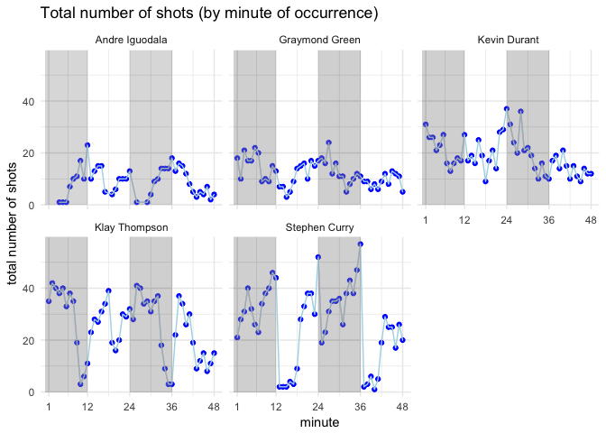

Hw02
================
Shi Fan Jin
3/4/2018

Please do not use code chunk options such as: echo = FALSE, eval = FALSE, results = 'hide'. All chunks must be visible and evaluated.
=====================================================================================================================================

``` r
library(dplyr)
```

    ## 
    ## Attaching package: 'dplyr'

    ## The following objects are masked from 'package:stats':
    ## 
    ##     filter, lag

    ## The following objects are masked from 'package:base':
    ## 
    ##     intersect, setdiff, setequal, union

``` r
library(ggplot2)
```

``` r
shots_data <- read.csv(file = "../data/shots-data.csv", stringsAsFactors = FALSE)
iguodala <- filter(shots_data, name == "Andre Iguodala")
green <- filter(shots_data, name == "Graymond Green")
durant <- filter(shots_data, name == "Kevin Durant")
thompson <- filter(shots_data, name == "Klay Thompson")
curry <- filter(shots_data, name == "Stephen Curry")
```

##### 5.1) Total Shots by Player (10 pts)

``` r
total_shots <- arrange(
  summarise(
    group_by(shots_data, name),
    total = n()
  ),
  desc(total)
)

total_shots
```

    ## # A tibble: 5 x 2
    ##   name           total
    ##   <chr>          <int>
    ## 1 Stephen Curry   1250
    ## 2 Klay Thompson   1220
    ## 3 Kevin Durant     915
    ## 4 Graymond Green   578
    ## 5 Andre Iguodala   371

##### 5.2) Effective Shooting Percentage (10 pts)

``` r
# Effective Shooting % by Player
shots_data %>% 
  group_by(name) %>%
  summarise(
    total = n(),
    made = sum(shot_made_flag == "made shot"),
    perc_made = made/total) %>%
  arrange(desc(perc_made))
```

    ## # A tibble: 5 x 4
    ##   name           total  made perc_made
    ##   <chr>          <int> <int>     <dbl>
    ## 1 Kevin Durant     915   495     0.541
    ## 2 Andre Iguodala   371   192     0.518
    ## 3 Klay Thompson   1220   575     0.471
    ## 4 Stephen Curry   1250   584     0.467
    ## 5 Graymond Green   578   245     0.424

``` r
# 2PT Effective Shooting % by Player
shots_data %>%
  group_by(name) %>%
  summarise( 
    total = n(),
    made = sum(shot_made_flag == "made shot" & shot_type == "2PT Field Goal"),
    perc_made = made/total) %>%
  arrange(desc(perc_made))
```

    ## # A tibble: 5 x 4
    ##   name           total  made perc_made
    ##   <chr>          <int> <int>     <dbl>
    ## 1 Kevin Durant     915   390     0.426
    ## 2 Andre Iguodala   371   134     0.361
    ## 3 Graymond Green   578   171     0.296
    ## 4 Klay Thompson   1220   329     0.270
    ## 5 Stephen Curry   1250   304     0.243

``` r
# 3PT Effective Shooting % by Player

shots_data %>%
  group_by(name) %>%
  summarise( 
    total = n(),
    made = sum(shot_made_flag == "made shot" & shot_type == "3PT Field Goal"),
    perc_made = made/total) %>%
  arrange(desc(perc_made))
```

    ## # A tibble: 5 x 4
    ##   name           total  made perc_made
    ##   <chr>          <int> <int>     <dbl>
    ## 1 Stephen Curry   1250   280     0.224
    ## 2 Klay Thompson   1220   246     0.202
    ## 3 Andre Iguodala   371    58     0.156
    ## 4 Graymond Green   578    74     0.128
    ## 5 Kevin Durant     915   105     0.115

##### 6.1) dplyr table (10 pts)

``` r
shot_distance <- shots_data %>%
  group_by(shot_distance) %>%
  summarise(
    total = n(),
    made = sum(shot_made_flag == "made shot"),
    made_shot_prop = made/total) %>%
  select(c(shot_distance, made_shot_prop))

shot_distance
```

    ## # A tibble: 56 x 2
    ##    shot_distance made_shot_prop
    ##            <int>          <dbl>
    ##  1             0          0.841
    ##  2             1          0.668
    ##  3             2          0.534
    ##  4             3          0.373
    ##  5             4          0.411
    ##  6             5          0.286
    ##  7             6          0.396
    ##  8             7          0.395
    ##  9             8          0.463
    ## 10             9          0.321
    ## # ... with 46 more rows

##### 6.2) ggplot (10 pts)

``` r
ggplot(data = shot_distance, aes(x = shot_distance, y = made_shot_prop)) +
  geom_point() 
```

 **We can see that for those shot\_distance below 30 has a higher proportion, whereas for those shot from a longer distance, the chance it got in is very low which is around 0 in the graph. So, from my point of view, we can confirm that the shorter the distance, the more effective the shots. As for the distance of having a percentage (of making a shot) of 50% or more is will be the ones around 1 to 3, and also for 51(which in this case is a extreme value for me).**

##### 7) Total number of shots by minute of occurrence (10 pts)

``` r
shots_minute_occurrence <- shots_data %>%
  group_by(name, minute) %>%
  summarise(
    total = n())
 

ggplot(dat = shots_minute_occurrence, aes(x = minute, y = total)) +
  geom_point(col = "blue") +
  facet_wrap( ~ name) +
  theme_minimal() +
  geom_path(aes(x=minute,y=total),linejoin="round",lineend="round",col="light blue") +
  scale_x_continuous(breaks=c(1,12,24,36,48)) +
  geom_rect(xmin = 0, xmax = 12, ymin = 0, ymax = 60, fill = "grey80", alpha = 0.01) +
  geom_rect(xmin = 24, xmax = 36, ymin = 0, ymax = 60, fill = "grey80", alpha = 0.01) +
  ggtitle("Total number of shots (by minute of occurrence)") +
  ylab("total number of shots")
```


