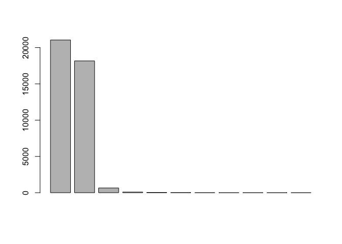

hw04
================
Shi Fan Jin
4/9/2018

``` r
library(stringr)
library(dplyr)
```

    ## 
    ## Attaching package: 'dplyr'

    ## The following objects are masked from 'package:stats':
    ## 
    ##     filter, lag

    ## The following objects are masked from 'package:base':
    ## 
    ##     intersect, setdiff, setequal, union

``` r
library(ggplot2)
source(file = '../code/archive-functions.R')
```

### 1.4) Archive of "stringr"

``` r
raw_data <- read_archive('stringr')
clean_data <- clean_archive(raw_data)
plot_archive(clean_data)
```


``` r
#Export the table as a CSV file "stringr-archive.csv" to the data/ folder.
write.csv(clean_data, file = '~/Desktop/shifanjin-repo/hw04/data/stringr-archive.csv')
```

### 1.5) Archives of "dplyr", "ggplot2", "XML", and "knitr"

``` r
raw_data_dplyr <- read_archive("dplyr")
clean_data_dplyr <- clean_archive(raw_data_dplyr)
#Export the table as a CSV file "stringr-archive.csv" to the data/ folder.
write.csv(clean_data_dplyr, file = '~/Desktop/shifanjin-repo/hw04/data/dplyr-archive.csv')
```

``` r
raw_data_ggplot2 <- read_archive("ggplot2")
clean_data_ggplot2 <- clean_archive(raw_data_ggplot2)
write.csv(clean_data_ggplot2, file = '~/Desktop/shifanjin-repo/hw04/data/ggplot2-archive.csv')
```

``` r
raw_data_xml <- read_archive("XML")
clean_data_xml <- clean_archive(raw_data_xml)
write.csv(clean_data_xml, file = '~/Desktop/shifanjin-repo/hw04/data/xml-archive.csv')
```

``` r
raw_data_knitr <- read_archive("knitr")
clean_data_knitr <- clean_archive(raw_data_knitr)
write.csv(clean_data_knitr, file = '~/Desktop/shifanjin-repo/hw04/data/knitr-archive.csv')
```

#### In your Rmd file, combine (or merge) all the data tables in one single data frame and use "ggplot2" to create two step line charts:

``` r
all_tbl <- rbind(clean_data_dplyr, clean_data_ggplot2, clean_data_knitr, clean_data_xml)


ggplot(data = all_tbl) + 
geom_step(aes(x = date, y = size, color = name), size= 1) +
ylab('size(Kilobytes)') + xlab('date')
```


``` r
ggplot(data = all_tbl) + 
geom_step(aes(x = date, y = size, color = name), size= 1) +
facet_wrap(~ name,scales='free') +
ylab('size(Kilobytes)') + xlab('date')
```

 \#\#2) Regex Functions

``` r
source(file = "../code/regex-functions.R")
```

``` r
vec = split_chars('Go Bears!')
vec
```

    ## [1] "G" "o" " " "B" "e" "a" "r" "s" "!"

``` r
split_chars('Expecto Patronum')
```

    ##  [1] "E" "x" "p" "e" "c" "t" "o" " " "P" "a" "t" "r" "o" "n" "u" "m"

``` r
num_vowels(vec)
```

    ## a e i o u 
    ## 1 1 0 1 0

``` r
count_vowels("The quick brown fox jumps over the lazy dog")
```

    ## a e i o u 
    ## 1 3 1 4 2

``` r
count_vowels("THE QUICK BROWN FOX JUMPS OVER THE LAZY DOG")
```

    ## a e i o u 
    ## 1 3 1 4 2

``` r
reverse_chars("gattaca")
```

    ## [1] "acattag"

``` r
reverse_chars("Lumox Maxima")
```

    ## [1] "amixaM xomuL"

``` r
reverse_words("sentence! this reverse")
```

    ## [1] "reverse this sentence!"

``` r
reverse_words("string")
```

    ## [1] "string"

3) Data “Emotion in Text”
-------------------------

``` r
emotion = read.csv(file = "../data/text-emotion.csv", stringsAsFactors = FALSE)
content = emotion$content
str(content)
```

    ##  chr [1:40000] "@tiffanylue i know  i was listenin to bad habit earlier and i started freakin at his part =[" ...

### 3.1) Number of characters per tweet

``` r
char_num = lapply(content, nchar)
char_num = unlist(char_num)
summary(char_num)
```

    ##    Min. 1st Qu.  Median    Mean 3rd Qu.    Max. 
    ##    1.00   43.00   69.00   73.41  103.00  167.00

``` r
hist(char_num, main = "Histogram of the characters in each content", xlab = "number of characters", breaks = seq(from = 1, to = 175, by = 5))
```


### 3.2) Number of Mentions

``` r
# Count the number of @ mentions (i.e. mention to another user) in the tweet contents.
count_at = str_count(content, pattern = '@\\w+')

# Display such frequencies, and make a barplot of these counts (i.e. number of tweets
# with 0 mentions, with 1 mention, with 2 mentions, etc).
table_at = as.data.frame(table(count_at))
table_at
```

    ##    count_at  Freq
    ## 1         0 21043
    ## 2         1 18162
    ## 3         2   649
    ## 4         3    86
    ## 5         4    34
    ## 6         5    16
    ## 7         6     5
    ## 8         7     1
    ## 9         8     2
    ## 10        9     1
    ## 11       10     1

``` r
barplot(table_at$Freq)
```



``` r
#Also write code to display the content of the tweet with 10 mentions.
index = which.max(count_at)
content[index]
```

    ## [1] "last #ff  @Mel_Diesel @vja4041 @DemonFactory @shawnmcguirt @SEO_Web_Design @ChuckSwanson @agracing @confidentgolf @tluckow @legalblonde31"

### 3.3) Hashtags

``` r
count_hash = str_count(content, pattern = '#[[:alpha:]][[:alnum:]]*')
table_hash = as.data.frame(table(count_hash))
table_hash
```

    ##   count_hash  Freq
    ## 1          0 39261
    ## 2          1   650
    ## 3          2    66
    ## 4          3    17
    ## 5          5     1
    ## 6          7     1
    ## 7          8     1
    ## 8          9     3

``` r
barplot(table_hash$Freq)
```


``` r
all_hash<- unlist(str_extract_all(content, patter = "#[[:alpha:]][[:alnum:]]*"))
ave_hash = mean(nchar(all_hash)) - 1
ave_hash
```

    ## [1] 7.625

``` r
hash_length = nchar(all_hash) - 1
hash_freq = table(hash_length)
hash_freq
```

    ## hash_length
    ##  1  2  3  4  5  6  7  8  9 10 11 12 13 14 15 16 17 18 19 20 21 22 34 
    ##  1 71 74 97 74 59 75 73 97 51 54 63 18 22 27  7  6  3  2  2  2  1  1

``` r
max_hash = max(hash_freq)
print("The mode of the length of the hashtags are 4 and 9, where there are 97 for each 4 and 9")
```

    ## [1] "The mode of the length of the hashtags are 4 and 9, where there are 97 for each 4 and 9"
