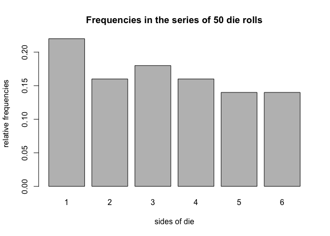
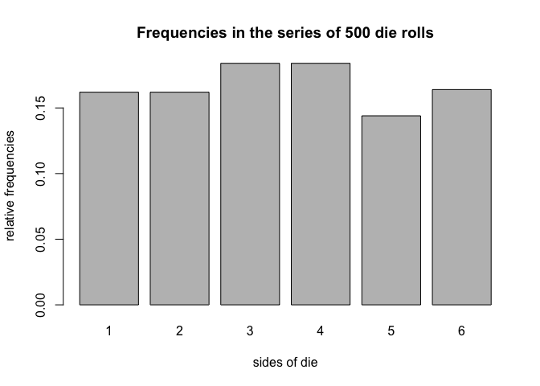

hw05
================
Shi Fan Jin
4/27/2018

``` r
library(dieroller)
```

### how to use my package: "dieroller"

``` r
#default die
fair_die <- die() 
fair_die
```

    ## object "die"
    ## 
    ##   side      prob
    ## 1    1 0.1666667
    ## 2    2 0.1666667
    ## 3    3 0.1666667
    ## 4    4 0.1666667
    ## 5    5 0.1666667
    ## 6    6 0.1666667

``` r
#die with non-standard sides
weird_die <- die(sides = c('i', 'ii', 'iii', 'iv', 'v', 'vi')) 
weird_die
```

    ## object "die"
    ## 
    ##   side      prob
    ## 1    i 0.1666667
    ## 2   ii 0.1666667
    ## 3  iii 0.1666667
    ## 4   iv 0.1666667
    ## 5    v 0.1666667
    ## 6   vi 0.1666667

``` r
#create a loaded die
loaded_die <- die(prob = c(0.075, 0.1, 0.125, 0.15, 0.20, 0.35)) 
loaded_die
```

    ## object "die"
    ## 
    ##   side  prob
    ## 1    1 0.075
    ## 2    2 0.100
    ## 3    3 0.125
    ## 4    4 0.150
    ## 5    5 0.200
    ## 6    6 0.350

``` r
#bad sides
#bad_die <- die(sides = c('a', 'b', 'c', 'd', 'e'))

#bad prob
#bad_die <- die(sides = c('a', 'b', 'c', 'd', 'e', 'f'), prob = c(0.2, 0.1, 0.1, 0.1, 0.5, 0.1))
#bad_die


# roll fair die 50 times
fair_die <- die() 
set.seed(123)
fair50 <- roll(fair_die, times = 50) 

fair50
```

    ## object "roll"
    ## 
    ## $rolls
    ##  [1] 3 6 4 1 1 2 5 1 5 4 1 4 6 5 2 1 3 2 3 1 1 6 5 1 5 6 5 5 3 2 1 1 6 6 2
    ## [36] 4 6 3 3 3 2 4 4 4 2 2 3 4 3 1

``` r
names(fair50)
```

    ## [1] "rolls" "sides" "prob"  "total"

``` r
fair50$rolls
```

    ##  [1] 3 6 4 1 1 2 5 1 5 4 1 4 6 5 2 1 3 2 3 1 1 6 5 1 5 6 5 5 3 2 1 1 6 6 2
    ## [36] 4 6 3 3 3 2 4 4 4 2 2 3 4 3 1

``` r
fair50$sides
```

    ## [1] 1 2 3 4 5 6

``` r
fair50$prob
```

    ## [1] 0.1666667 0.1666667 0.1666667 0.1666667 0.1666667 0.1666667

``` r
fair50$total
```

    ## [1] 50

``` r
#string die
str_die <- die(sides = c('a', 'b', 'c', 'd', 'e', 'f'), prob = c(0.075, 0.1, 0.125, 0.15, 0.20, 0.35))
#roll 20 times
set.seed(123)
str_rolls <- roll(str_die, times = 20) 
names(str_rolls)
```

    ## [1] "rolls" "sides" "prob"  "total"

``` r
str_rolls
```

    ## object "roll"
    ## 
    ## $rolls
    ##  [1] "f" "c" "e" "b" "a" "f" "e" "b" "d" "e" "a" "e" "d" "d" "f" "b" "f"
    ## [18] "f" "f" "a"

``` r
#for summary
fair50_sum <- summary(fair50)
fair50_sum
```

    ## summary "roll"
    ## 
    ##   side count prob
    ## 1    1    11 0.22
    ## 2    2     8 0.16
    ## 3    3     9 0.18
    ## 4    4     8 0.16
    ## 5    5     7 0.14
    ## 6    6     7 0.14

``` r
class(fair50_sum)
```

    ## [1] "summary.roll"

``` r
names(fair50_sum)
```

    ## [1] "freqs"

``` r
fair50_sum$freqs
```

    ##   side count prob
    ## 1    1    11 0.22
    ## 2    2     8 0.16
    ## 3    3     9 0.18
    ## 4    4     8 0.16
    ## 5    5     7 0.14
    ## 6    6     7 0.14

``` r
#plot method
plot(fair50)
```



``` r
#EXAMPLES
# roll fair die
set.seed(123)
fair_die <- die()
fair500 <- roll(fair_die, times = 500)

# summary method
summary(fair500)
```

    ## summary "roll"
    ## 
    ##   side count  prob
    ## 1    1    80 0.160
    ## 2    2    81 0.162
    ## 3    3    92 0.184
    ## 4    4    92 0.184
    ## 5    5    72 0.144
    ## 6    6    83 0.166

``` r
# extracting roll in position 500
fair500[500]
```

    ## [1] 6

``` r
# replacing last roll
fair500[500] <- 1
fair500[500]
```

    ## [1] 1

``` r
summary(fair500)
```

    ## summary "roll"
    ## 
    ##   side count  prob
    ## 1    1    81 0.162
    ## 2    2    81 0.162
    ## 3    3    92 0.184
    ## 4    4    92 0.184
    ## 5    5    72 0.144
    ## 6    6    82 0.164

``` r
# adding 100 rolls
fair600 <- fair500 + 100 
summary(fair600)
```

    ## summary "roll"
    ## 
    ##   side count      prob
    ## 1    1   100 0.1666667
    ## 2    2    97 0.1616667
    ## 3    3   104 0.1733333
    ## 4    4   109 0.1816667
    ## 5    5    91 0.1516667
    ## 6    6    99 0.1650000

``` r
# plot method
plot(fair500, 500)
```



### De Mere's Problem

#### Problem 1.

The first problem involves computing the probability of getting at least one “6” in four rolls of a die in a series of 1000 games

``` r
roll4 <- c()
count1 <- 0

for (i in 1:1000) {
  roll4 <- roll(die(), 4)
  if (roll4[1] == 6 | roll4[2] == 6 | roll4[3] == 6 | roll4[4] == 6) {
    count1 = count1 + 1
  }
}

cat("The number of games in which there is at least one 6 =", count1, "games")
```

    ## The number of games in which there is at least one 6 = 526 games

``` r
cat("\nRelative frequency of at least getting one 6 =", count1/1000)
```

    ## 
    ## Relative frequency of at least getting one 6 = 0.526

#### Problem 2.

The other problem involves computing the probability of getting at least two “6” in 24 rolls of a pair of dice

``` r
roll1 <- c()
roll2 <- c()
double6 <- c()
count2 <- 0

for (j in 1:1000) {
  roll1 <- roll(die(), 24)
  roll2 <- roll(die(), 24)
  for (k in 1:24) {
    if (roll1[k] == 6 && roll2[k] == 6) {
      double6[k] <- TRUE
    } else {
      double6[k] <- FALSE
    }
  }
  if (TRUE%in%double6 == TRUE) {
    count2 = count2 + 1
  } else {
    count2 = count2
  }
}

cat("The number of games in which there is at least one double 6 =", count2, "games")
```

    ## The number of games in which there is at least one double 6 = 469 games

``` r
cat("\nRelative frequency of at least getting one double 6 =", count2/1000)
```

    ## 
    ## Relative frequency of at least getting one double 6 = 0.469
